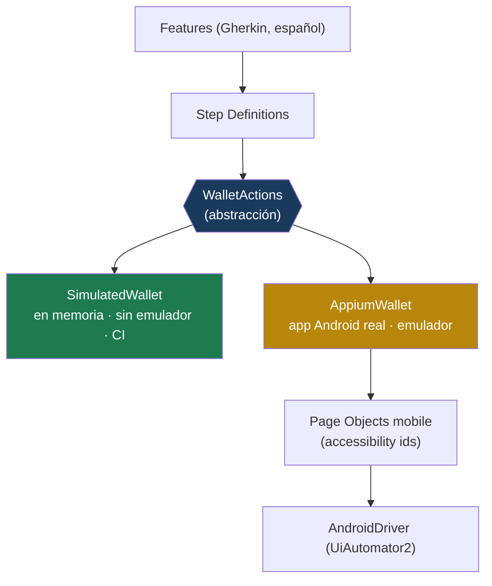

# nexo-wallet-mobile

Billetera móvil Android ficticia de **Nexo Finanzas** y su **automatización con Appium**: un
framework mobile en Java con Cucumber (BDD) y Page Object Model, diseñado para correr en **dos
modos** — simulado (sin emulador, apto para CI) o real (contra la app en un emulador/dispositivo).


> ⚠️ **Datos ficticios.** Usuarios, cuentas y saldos son de demostración y no representan a ninguna
> entidad ni persona real.

---

## 🔍 Estado de verificación (léase primero)

Este repositorio es transparente sobre qué está probado y qué no:

| Componente | Estado |
|---|---|
| Escenarios BDD contra la billetera **simulada** | ✅ **Ejecutados y en verde** (6 escenarios) |
| Construcción de **capabilities de Appium** desde configuración | ✅ **Verificada** (2 pruebas) |
| Ejecución contra **emulador/dispositivo Android real** | 🔴 **No ejecutada aquí** — requiere Android SDK + emulador. El código es real y compila; los pasos para correrlo están en [`docs/runbooks/local-setup.md`](docs/runbooks/local-setup.md). |

No se afirma ninguna corrida que no haya ocurrido. Ver [`evidence/`](evidence/).

---

## ⏱️ En 5 minutos

**Qué es.** Una suite de automatización mobile que ejercita los journeys de la billetera (ingreso,
saldos, transferencia) en lenguaje de negocio, sobre una **abstracción** que permite ejecutarlos
contra la app real (Appium) o contra una implementación simulada.

**Prerequisitos.** JDK 21 y Maven. (Para el modo real: Appium Server, Android SDK, emulador y el APK.)

```bash
mvn test                        # modo simulado (por defecto) — 8 pruebas en verde
mvn test -DwalletMode=appium    # modo real — requiere Appium + emulador + APK
```

---

## 🧭 Para desarrolladores y QA

### La idea central: una abstracción, dos modos



Los escenarios **no conocen Appium**: hablan el lenguaje de `WalletActions`. Una sola perilla
(`-DwalletMode=appium`) intercambia el destino sin tocar features ni steps. Es el mismo patrón
mock-vs-proveedor-real que se aplica a cualquier dependencia gateada por device, licencia o credenciales.

### Estructura

```
src/main/java/com/nexo/wallet/
├── WalletActions.java        # la abstracción que hablan los escenarios
├── TransferResult.java
├── simulated/SimulatedWallet.java   # implementación en memoria (imita el contrato de la API)
├── appium/
│   ├── AppiumWallet.java            # implementación real (conduce la app Android)
│   ├── AppiumDriverFactory.java     # crea el AndroidDriver
│   ├── MobileConfig.java            # capabilities desde variables de entorno
│   └── screens/                     # Page Objects mobile (accessibility ids)
└── support/WalletFactory.java       # elige el modo
src/test/java/com/nexo/wallet/       # hooks, steps, runner, prueba de capabilities
src/test/resources/features/         # escenarios .feature (BDD en español)
```

### Principios

- **Selectores por accessibility id** (`content-desc`): estables, independientes del texto y de la
  jerarquía visual; son un contrato de testabilidad acordado con desarrollo.
- **Esperas explícitas** en `BaseScreen`; nunca `sleep`.
- **Aislamiento por escenario**: billetera nueva y estado re-sembrado en cada escenario.
- **Los escenarios son agnósticos del driver**: eso permite verificarlos sin emulador y reutilizarlos
  contra el dispositivo real.

### Evidencia

Corridas reales en [`evidence/`](evidence/). Reporte Cucumber: `target/cucumber/report.html`.

---

## 👔 Para líderes de proyecto y reclutadores

- **Qué demuestra:** diseño de un framework de automatización **mobile** (Appium + Cucumber + POM)
  con una arquitectura que lo hace **testeable y ejecutable en CI** aun sin granja de dispositivos —
  un problema real y costoso en organizaciones financieras.
- **Honestidad de la evidencia:** el repositorio distingue explícitamente lo verificado de lo no
  verificado. Esa disciplina es parte del oficio.
- **Trazabilidad:** reglas → escenarios en [`docs/quality/traceability.md`](docs/quality/traceability.md);
  decisiones en [`docs/adr/`](docs/adr/).

### Mapa de documentación

| Necesito… | Ir a |
|---|---|
| Empezar de cero | [`docs/00-empezar-aqui.md`](docs/00-empezar-aqui.md) |
| La app y el contrato imitado | [`docs/01-la-app-y-el-contrato.md`](docs/01-la-app-y-el-contrato.md) |
| Arquitectura | [`docs/architecture/`](docs/architecture/) |
| Decisiones técnicas | [`docs/adr/`](docs/adr/) |
| Estrategia de pruebas / riesgos / trazabilidad | [`docs/quality/`](docs/quality/) |
| Correr contra un emulador real | [`docs/runbooks/local-setup.md`](docs/runbooks/local-setup.md) |
| Aprender los conceptos | [`docs/learning/`](docs/learning/) |

---

## Ecosistema Nexo Finanzas

Repositorio **3 de 7**. Automatiza el canal mobile, que **imita el contrato** del núcleo
[`nexo-transfer-api`](https://github.com/fercarballo/nexo-transfer-api) (repo 1), en paralelo al
canal web [`nexo-web-banking-e2e`](https://github.com/fercarballo/nexo-web-banking-e2e) (repo 2).

## Licencia

MIT — ver [`LICENSE`](LICENSE). (English: [`README.en.md`](README.en.md).)
