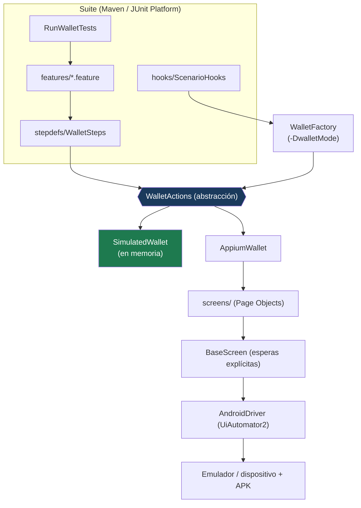

# Arquitectura — Componentes del framework (C4 nivel 2)

## Componentes

| Componente | Responsabilidad |
|---|---|
| **features/** | Escenarios de negocio (Gherkin, español). |
| **stepdefs/** | Traducen cada paso a llamadas de `WalletActions`. **No conocen Appium.** |
| **WalletActions** | La abstracción: `login`, `welcome`, `balanceOf`, `transfer`, `loginError`. |
| **SimulatedWallet** | Implementación en memoria; imita el contrato. Corre sin emulador. |
| **AppiumWallet** | Implementación real; conduce la app con Page Objects mobile. |
| **WalletFactory** | Elige el modo (`simulated` por defecto, `appium` con la propiedad). |
| **BaseScreen** | Esperas explícitas y localización por accessibility id. |

## Compartir estado entre steps

`TestContext` (inyectado por **PicoContainer**) guarda la billetera activa del escenario, de modo
que hooks y steps operen sobre la misma instancia sin estado estático.
