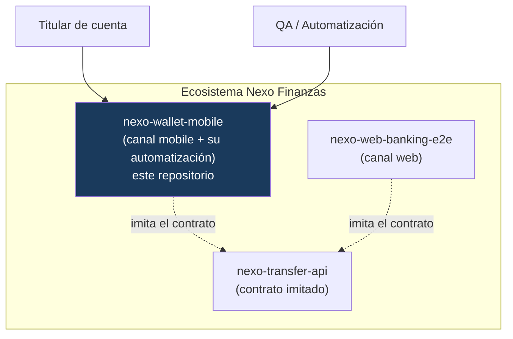

# Arquitectura — Contexto (C4 nivel 1)

## Elementos

| Elemento | Rol |
|---|---|
| **Titular de cuenta** | Usa la billetera para ingresar y transferir. |
| **QA / Automatización** | Ejecuta la suite: contra la app real (Appium) o contra la simulación. |
| **nexo-wallet-mobile** | La app Android ficticia y el framework que la automatiza (este repo). |
| **nexo-transfer-api** | El núcleo cuyo contrato la billetera **imita**. |

## Decisión de contexto

El canal mobile **no reimplementa** las reglas del negocio de forma distinta: las espeja. Así, la
regresión mobile valida la **experiencia del canal**, mientras que la corrección de las reglas a
nivel servicio ya está cubierta por las pruebas de la API (sin duplicar cobertura).
