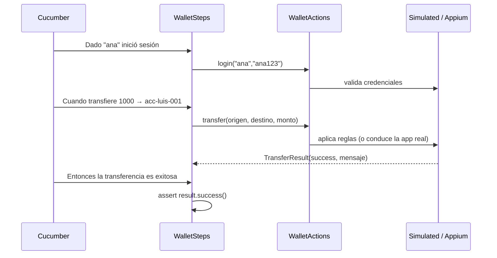
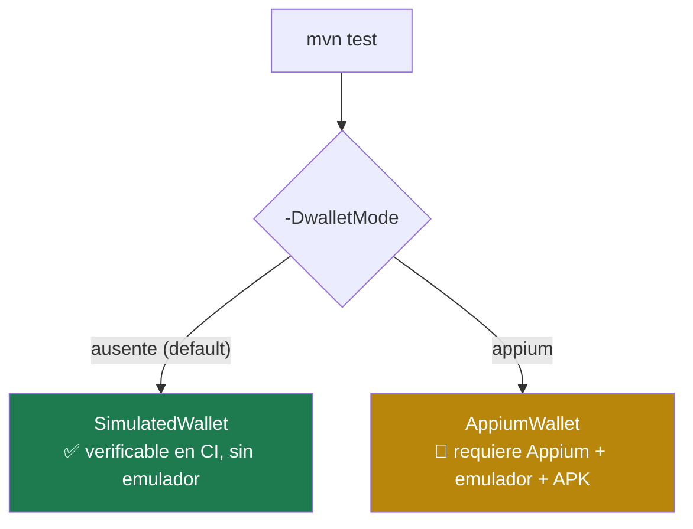
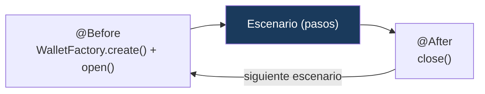

# Arquitectura — Flujos

## Secuencia: un escenario de transferencia

```mermaid
sequenceDiagram
    participant Cuc as Cucumber
    participant Step as WalletSteps
    participant W as WalletActions
    participant Impl as Simulated / Appium

    Cuc->>Step: Dado "ana" inició sesión
    Step->>W: login("ana","ana123")
    W->>Impl: valida credenciales
    Cuc->>Step: Cuando transfiere 1000 → acc-luis-001
    Step->>W: transfer(origen, destino, monto)
    W->>Impl: aplica reglas (o conduce la app real)
    Impl-->>Step: TransferResult(success, mensaje)
    Cuc->>Step: Entonces la transferencia es exitosa
    Step->>Step: assert result.success()
```

## Selección de modo

```mermaid
flowchart TD
    start["mvn test"] --> mode{"-DwalletMode"}
    mode -->|"ausente (default)"| sim["SimulatedWallet<br/>✅ verificable en CI, sin emulador"]
    mode -->|"appium"| real["AppiumWallet<br/>🔴 requiere Appium + emulador + APK"]
    style sim fill:#1e7a4f,color:#fff
    style real fill:#b8860b,color:#fff
```

## Ciclo de vida por escenario

```mermaid
flowchart LR
    a["@Before<br/>WalletFactory.create() + open()"] --> b["Escenario (pasos)"]
    b --> c["@After<br/>close()"]
    c -->|siguiente escenario| a
    style b fill:#1a3a5c,color:#fff
```
